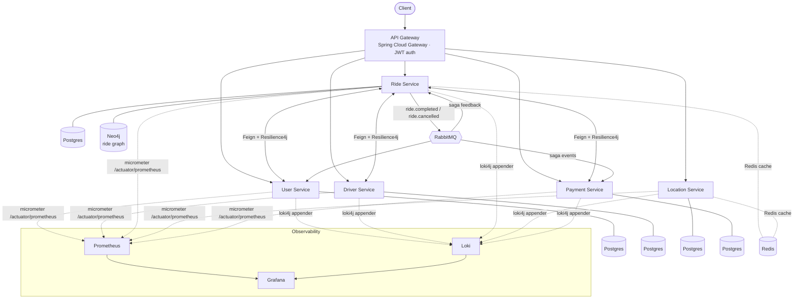

# Uber-Style Ride-Hailing Microservices Platform

A production-style, event-driven **ride-hailing backend** built as six independently deployable Spring Boot services behind an API gateway, with polyglot persistence, a RabbitMQ saga for distributed transactions, and a full Prometheus / Grafana / Loki observability stack — deployable locally via Docker Compose or to Kubernetes.

> **Note on authorship.** This started as a team university project (Advanced Computer Lab, GUC). This repository is a **cleaned, standalone showcase** of the platform. My own work centered on the **ride-service**, the **distributed saga / event flow**, and the **Kubernetes + observability infrastructure** — see [My Contribution](#my-contribution). Coursework material, grading artifacts, and teammates' personal data have been removed.

---

## Architecture



See [`docs/ARCHITECTURE.md`](docs/ARCHITECTURE.md) for the saga flow, caching strategy, and request lifecycle in detail.

---

## Services

| Service | Responsibility | Datastores |
|---|---|---|
| **api-gateway** | Single entry point, JWT validation, routing, health passthrough | — |
| **user-service** | Riders, auth, wallet / `totalSpent` ledger | Postgres |
| **driver-service** | Drivers, availability, earnings | Postgres |
| **ride-service** | Ride lifecycle, matching, fare, ride-interaction graph | Postgres + **Neo4j** + Redis |
| **location-service** | GPS tracking, geo analytics, audit events | Postgres + Redis |
| **payment-service** | Payment processing, payment saga participant | Postgres |

Each service owns its database (**database-per-service**) — no shared schema, no cross-service SQL.

---

## Tech Stack

| Layer | Technology |
|---|---|
| **Language / Runtime** | Java 25 (`eclipse-temurin:25`) |
| **Framework** | Spring Boot 4.0.x, Spring Cloud 2025.1.1 |
| **Gateway** | Spring Cloud Gateway (reactive / WebFlux) |
| **Sync comms** | OpenFeign clients + Resilience4j circuit breakers |
| **Async comms** | RabbitMQ (event-driven **saga** for distributed transactions) |
| **Persistence** | PostgreSQL 17 (per service), Neo4j (ride graph), Redis (cache) |
| **Auth** | JWT, validated at the gateway and per-service |
| **Observability** | Micrometer → Prometheus, Grafana dashboards, Loki (loki4j), CorrelationId/MDC trace propagation |
| **Packaging** | Docker (multi-stage builds), Docker Compose |
| **Orchestration** | Kubernetes — Deployments, StatefulSets, ConfigMaps, Secrets, Services, monitoring stack |

---

## Highlights

- **Event-driven saga** — the ride → payment flow is coordinated asynchronously over RabbitMQ (`ride.completed` / `ride.cancelled` → payment processing → saga feedback), keeping each service's state consistent without a distributed transaction coordinator.
- **Resilient sync calls** — inter-service Feign calls are wrapped in Resilience4j circuit breakers so a slow/down dependency degrades gracefully instead of cascading.
- **Polyglot persistence** — relational data in per-service Postgres; the rider↔driver interaction graph (`RODE_WITH`) in Neo4j; hot reads cached in Redis.
- **First-class observability** — every service exposes `/actuator/prometheus`; Grafana has a per-service dashboard; logs ship to Loki with a correlation ID propagated across service hops for end-to-end tracing.
- **Two deployment targets** — `docker compose up` for local dev; full Kubernetes manifests (incl. the monitoring stack) under [`k8s/`](k8s/).

---

## Running Locally

```bash
# Build all services and start the full stack (services + datastores + monitoring)
docker compose up --build
```

Once up:
- API Gateway → `http://localhost:8080`
- Grafana → `http://localhost:3000`
- RabbitMQ management → `http://localhost:15672`

> Default local credentials are non-secret demo values (`postgres/postgres`, etc.) intended for local development only.

### On Kubernetes

```bash
kubectl apply -f k8s/namespaces/
kubectl apply -f k8s/         # configmaps, secrets, statefulsets, deployments, services, monitoring
# or use the ordered helper:
bash k8s/deploy-order.sh
```

---

## My Contribution

I contributed **100+ commits** across the platform, focused on:

- **Ride-service (primary owner)** — domain model, repositories, ride lifecycle/matching logic, and the Neo4j ride-interaction graph.
- **Distributed saga & messaging** — typed RabbitMQ events for the ride→payment flow, saga feedback consumers, and idempotent/ordering fixes in the payment participant.
- **Observability & infrastructure** — the Prometheus + Grafana + Loki stack, per-service Grafana dashboards, Micrometer wiring, CorrelationId/MDC trace propagation, and Kubernetes deployments, StatefulSets, probes, and monitoring manifests.
- **Location-service & gateway** — controller/service/security work and JWT handling on health/actuator paths at the gateway.

---

## License

[MIT](LICENSE) — for the showcase code authored by this project's team.
